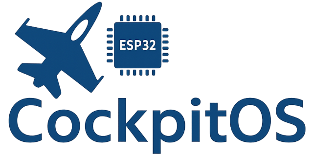

# The CockpitOS firmware project (ESP32)

**ESP32 firmware for DCS World cockpit panels**




CockpitOS connects physical cockpit hardware/panels to DCS World via the [DCS-BIOS protocol](https://github.com/DCS-Skunkworks/dcs-bios). It runs natively across the entire ESP32 family—Classic, C3, C5, C6, P4, S2, and S3—supporting buttons, switches, encoders, LEDs, TFT displays, and segment displays out of the box. With transport options spanning legacy Serial (socat), Wi-Fi, and native USB, CockpitOS delivers the flexibility modern cockpit builders demand. Think of it as the [DCS-BIOS Arduino Library](https://github.com/DCS-Skunkworks/dcs-bios-arduino-library)—reimagined for performance and scale on ESP32 devices with native USB support or Wi-Fi

---

## Features

**Inputs**
- Buttons, toggle switches, rotary encoders, multi-position selectors
- Analog axes with self-calibration
- I²C expanders (PCA9555) and shift registers (74HC165) for high pin counts
- Matrix scanning for rotary switches
- Debouncing and edge detection built-in

**Outputs**
- GPIO LEDs with PWM dimming
- WS2812 addressable RGB LEDs
- TM1637 and GN1640T LED drivers
- HT1622 segment LCD displays (IFEI, UFC, etc.)
- SPI TFT gauges via LovyanGFX

**Connectivity**
- USB HID (recommended) — works with included HID Manager
- WiFi UDP — for wireless panels
- Serial — legacy support (socat)

**Architecture**
- Static memory allocation — no heap fragmentation
- Non-blocking I/O throughout
- O(1) label lookups via perfect hashing
- 250 Hz input polling, 30-60 Hz display refresh
- Per-aircraft configuration via Label Sets

---

## Supported Hardware

| MCU | Status |
|-----|--------|
| ESP32-S2 | ✅ Recommended (native USB) |
| ESP32-S3 | ✅ Recommended (native USB) |
| ESP32 (original) | ✅ Works (Serial/WiFi only) |
| ESP32-C3 and C6  | ✅ Works (Serial/WiFi only) |

Popular boards: LOLIN S2 Mini, LOLIN S3 Mini (or any other Classic, S2 or S3 dev board from Amazon)

---

## Quick Start

1. **Install Arduino IDE 2.x** with ESP32 Arduino Core ≥ 3.3.0
2. **Open CockpitOS** in the IDE
3. **Select a label set** in `src/LABELS/` (start with `LABEL_SET_TEST_ONLY`)
4. **Configure transport** in `Config.h` (USB, WiFi, or Serial)
5. **Compile and upload** to your ESP32

For USB mode, run `HID Manager/HID_Manager.py` on your PC to bridge to DCS-BIOS.

---

## Documentation

| Guide | Description |
|-------|-------------|
| [Getting Started](Docs/GETTING_STARTED.md) | First-time setup, compile, upload |
| [Creating Label Sets](Docs/CREATING_LABEL_SETS.md) | Configure for your aircraft and hardware |
| [Hardware Wiring](Docs/HARDWARE_WIRING.md) | Wiring diagrams for all input/output types |
| [Transport Modes](Docs/TRANSPORT_MODES.md) | USB, WiFi, Serial configuration |
| [Advanced Displays](Docs/ADVANCED_DISPLAYS.md) | HT1622 segment displays, TFT gauges |
| [Advanced Controls](Docs/ADVANCED_CONTROLS.md) | Custom panels, CoverGate, panel registration |
| [FAQ](Docs/FAQ.md) | Common questions and answers |

---

## Project Structure

```
CockpitOS/
├── src/
│   ├── Core/              # Protocol handling, LED control, HID management
│   ├── Panels/            # Panel implementations (IFEI, ECM, etc.)
│   └── LABELS/            # Aircraft/panel configurations
├── lib/
│   └── CUtils/            # Hardware drivers (GPIO, I²C, displays)
├── HID Manager/           # PC-side USB bridge application
├── Tools/                 # RAM walker, test utilities
└── Docs/                  # Documentation
```

---

## How It Works

```
┌─────────────┐     ┌─────────────┐     ┌─────────────┐     ┌─────────────┐
│  DCS World  │────▶│  DCS-BIOS   │────▶│  CockpitOS  │────▶│  Hardware   │
│             │◀────│  (LUA)      │◀────│  (ESP32)    │◀────│  (Panel)    │
└─────────────┘     └─────────────┘     └─────────────┘     └─────────────┘
     Sim              Export/Import       Firmware           Physical I/O
```

DCS-BIOS exports cockpit state from the simulator. CockpitOS receives this data and drives your physical hardware. When you flip a switch, CockpitOS sends the command back through DCS-BIOS to the simulator.

---

## Label Sets

Label Sets define your panel's configuration:

- **InputMapping.h** — Buttons, switches, encoders, their GPIO pins, and DCS-BIOS commands
- **LEDMapping.h** — LEDs, their hardware type, and which DCS-BIOS indicators they represent

Run `python generate_data.py` in your label set folder to generate the runtime data files.

Included label sets:
- `LABEL_SET_TEST_ONLY` — Minimal test configuration
- `LABEL_SET_IFEI` — F/A-18C IFEI display panel

---

## Requirements

- Arduino IDE ≥ 2.3.6
- ESP32 Arduino Core ≥ 3.3.0
- Python 3.x (for generators and HID Manager)
- DCS World with DCS-BIOS installed

Optional:
- LovyanGFX (for TFT displays)

---

## Design Principles

CockpitOS follows embedded best practices:

- **No dynamic memory** — All buffers statically allocated
- **No blocking calls** — State machines and interrupts instead of delays
- **Bounded execution** — All loops have iteration limits
- **Fail-safe defaults** — Graceful handling of disconnections and errors

This isn't certified avionics software, but it's built with reliability in mind for long simulation sessions.

---

## License

MIT — See [LICENSE](LICENSE)

Free for personal and commercial use. Not certified for actual aircraft.

---

## Acknowledgments

- [DCS-BIOS Skunkworks](https://github.com/DCS-Skunkworks/dcs-bios) — The protocol that makes this possible
- [LovyanGFX](https://github.com/lovyan03/LovyanGFX) — The TFT library that powers our displays
- [DCS-BIOS Arduino Library](https://github.com/DCS-Skunkworks/dcs-bios-arduino-library) — The library that inspired our project

---

*Built by the CockpitOS Project Dev Team.*
